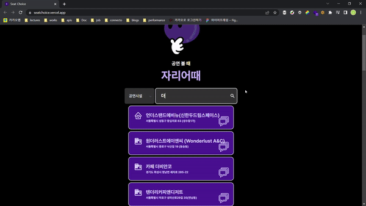
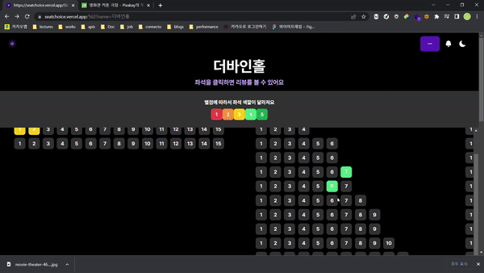
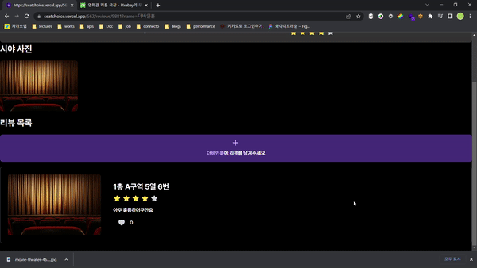
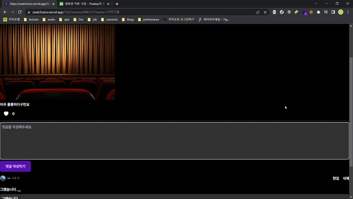
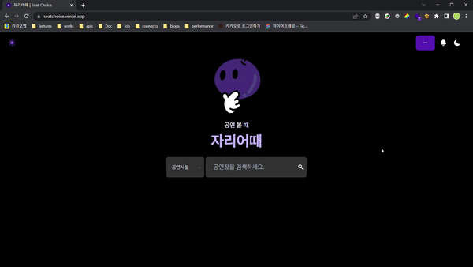

# 자리어때

**Seat Choice**

공연장 시야를 확인할 수 있는 리뷰 서비스 

  <a href="https://seat-choice.notion.site/d764a0c49d364c349e5cd35da124364c">노션</a>
  &nbsp; | &nbsp; 
  <a href="https://6405d8cdaa48b5c07ccbcbf8-uazhtdzclu.chromatic.com/">컴포넌트 문서</a>

 

📝 공연 관람시 해당 좌석에서 경험한 시야, 소리 등의 정보를 사진과 함께 **리뷰를 작성**할 수 있어요.

👀 공연/공연시설으로 검색하여 관련 **공연장의 좌석 리뷰들을 확인**할 수 있어요.

🔔 작성한 리뷰의 **댓글, 좋아요**를 남기고 이를 **알림**으로 확인할 수 있어요.

 

## 기술스택

 

## 주요 기능

### ⌨️ 검색

> 현재 진행하고 있는 공연과 공연 시설을 검색할 수 있어요.

<table align=center>
  <tr>
    <td>
      
    </td>
    <td>
      
    </td>
  </tr>
  <tr>
    <td>
      
공연시설 검색

    </td>
    <td>
      
공연 검색

    </td>
  </tr>
</table>

#### 자동 완성

> 자동완성 기능을 통해 쉽게 검색할 수 있어요.

<table align=center>
  <tr>
    <td>
      
    </td>
    <td>
      
    </td>
  </tr>
  <tr>
    <td>
      
자동완성 키보드

    </td>
    <td>
      
자동완성 마우스

    </td>
  </tr>
</table>

### 📝 리뷰

> 공연장 좌석에서 경험한 시야, 소리 등의 정보를 사진과 함께 리뷰를 작성할 수 있어요.
>
> 리뷰에 댓글, 좋아요를 남길 수 있어요.

<table align=center>
  <tr>
    <td>
      
    </td>
    <td>
      
    </td>
  </tr>
  <tr>
    <td>
      
리뷰 목록 조회

    </td>
    <td>
      
리뷰 상세 조회

    </td>
  </tr>
  <tr>
    <td>
      
    </td>
    <td>
      
    </td>
  </tr>
  <tr>
    <td>
      
리뷰 댓글 작성 & 수정

    </td>
    <td>
      
리뷰 좋아요

    </td>
  </tr>
</table>

### 💬 채팅

> 실시간으로 여러 사용자들과 공연에 관련된 정보를 나눌 수 있어요.

<table align=center>
  <tr>
    <td>
      
    </td>
    <td>
      
    </td>
  </tr>
  <tr>
    <td>
      
채팅

    </td>
    <td>
      
채팅 메세지가 많은 경우

    </td>
  </tr>
  <tr>
    <td>
      
    </td>
    <td>
      
    </td>
  </tr>
  <tr>
    <td>
      
채팅 참여하기

    </td>
    <td>
      
채팅 메세지 보내기

    </td>
  </tr>
</table>

### 🔔 알림

> 나의 리뷰에 달린 댓글, 좋아요를 알림 받을 수 있어요.

<table align=center>
  <tr>
    <td>
      
    </td>
  </tr>
  <tr>
    <td>
      
알림 기능

    </td>
  </tr>
</table>

 

## 팀원

<table>
  <tr>
    <td>
      
    </td>
    <td>
      
    </td>
  </tr>
  <tr>
    <td align=center>
      <a href="https://github.com/minkyung00">@minkyung00</a>
    </td>
     <td align=center>
      <a href="https://github.com/Pisodev77">@Pisodev77</a>
    </td>
  </tr>
</table>
